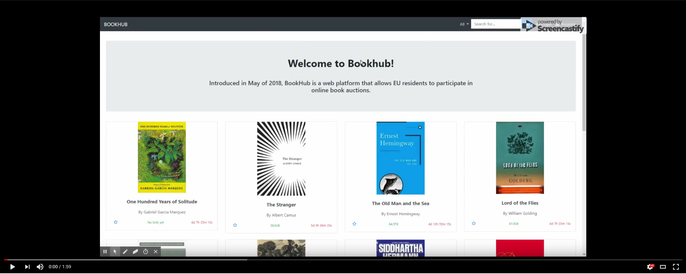

# A11: Apresentação

## 1. Apresentação do produto

O Bookhub é uma aplicação Web que oferece aos seus utilizadores uma plataforma de comercialização de livros através de leilões. Esta plataforma tem como público-alvo os residentes da União Europeia de modo a simplificar o processo de despacho internacional, que neste caso será livre de taxas aduaneiras. O acesso à plataforma é feito a partir de dispositivos móveis ou computadores com ligação à internet e a aplicação conta com um design responsivo e adaptável a dispositivos de tamanhos variáveis e com diferentes métodos de inputs (touchscreen, teclado e rato), e segue as boas práticas de acessibilidade e usabilidade.

A plataforma oferece várias funcionalidades aos seus utilizadores. Estes podem leiloar livros que possuam, estabelecendo um tempo durante o qual esse leilão irá decorrer. Por sua vez, outros utilizadores podem licitar no leilão, sendo que o utilizador com a licitação mais elevada no final do tempo ganhará o livro. O leiloeiro será notificado sobre quem ganhou o leilão e contactará essa pessoa de modo a receber o pagamento e enviar o artigo. Os utilizadores terão à sua disposição uma alargada gama de ferramentas e funcionalidades que complementam as duas anteriores: desde pesquisa avançada de leilões, às notificações personalizadas e às várias listas disponíveis (incluíndo uma lista de favoritos), nada faltará ao utilizador para que este possa ter uma experiência completa independentemente de ser um vendedor, um comprador ou ambos. A plataforma distingue-se também por uma moderação cuidada, sendo que cada leilão terá de ser aprovado por moderadores antes de poder ser licitado. Feedback entre compradores e vendedores é possível, mas estes também padecem de uma cuidada moderação manual. Por fim, existe um administrador que está encarregado de gerir todos os utilizadores, promovendo-lhes e revogando-lhes permissões conforme as circunstâncias.

URL do produto: http://lbaw1726.lbaw-prod.fe.up.pt

## 2. Vídeo de apresentação

[Link para o vídeo no YouTube](https://www.youtube.com/watch?v=VSI4KM_J1-M&feature=youtu.be)

## 3. Contactos

GROUP1726, 30/5/2018

> Daniel Vieira Azevedo, up201000307@fe.up.pt

> Nelson André Garrido da Costa, up201403128@fe.up.pt

> Rúben José da Silva Torres, up201405612@fe.up.pt

> Tiago Lascasas dos Santos, up201503616@fe.up.pt
