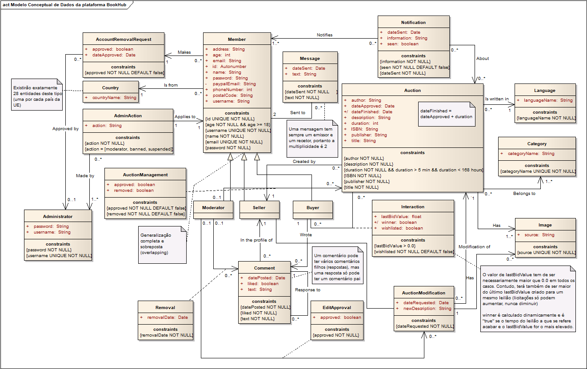

# A4: Modelo Conceptual de Dados

Neste artefacto é apresentado o modelo conceptual de dados da plataforma BookHub. Este modelo tem como objetivo a identificação das várias entidades presentes na base de dados da plataforma, dos seus atributos e de todas as relações entre si, assim como a especificação de várias restrições que visam cumprir os requisitos do sistema. No desenvolvimento deste artefacto foram também identificadas regras de negócio adicionais e que cuja especificação se encontra neste mesmo documento.

## 1. Diagrama de Classes

O seguinte diagrama de classes UML representa o modelo conceptual de dados do sistema. As restrições são incluídas sobre a forma de notas e constrições:

## 2. Regras de Negócio Adicionais

Como mencionado anteriormente, foram identificadas novas regras de negócio. Apesar de estas estarem exemplificadas no diagrama juntamente com as antigas, por uma questão de completude é apresentada a seguinte tabela com as novas:

Identificador|Nome|Descrição
---|---|---
RN06|Idade de registo|Um utilizador deve ter no mínimo 18 anos de idade para se poder registar.
RN07|Comentários|Um comentário poderá ter um ou mais comentários "filhos", mas um comentário nunca pode ter mais do que um comentário "pai".
RN08|Edição de leilão|A edição de um leilão obriga necessariamente à edição da sua descrição, sendo que a adição de novas imagens é opcional.
RN09|Remoção de conta|Apesar de ser permitido ao utilizador pedir para a sua conta ser removida, após a remoção ficará para sempre guardado um registo de quando tal ocorreu. Os leilões, comentários e *feedback* criados por esse utilizador também não serão removidos do sistema.

***

GROUP1726, 24/2/2018

> Daniel Vieira Azevedo, up201000307@fe.up.pt

> Nelson André Garrido da Costa, up201403128@fe.up.pt

> Rúben José da Silva Torres, up201405612@fe.up.pt

> Tiago Lascasas dos Santos, up201503616@fe.up.pt
