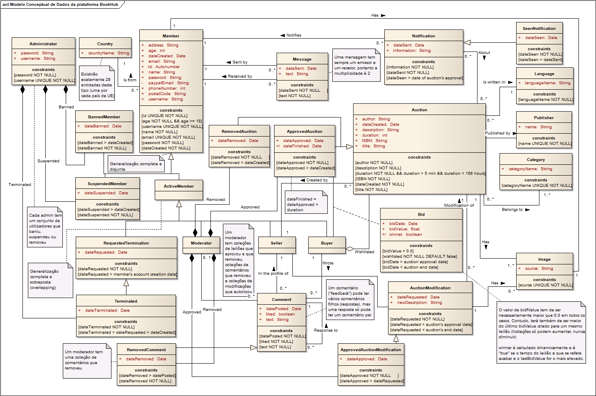

# A4: Modelo Conceptual de Dados

Neste artefacto é apresentado o modelo conceptual de dados da plataforma BookHub. Este modelo tem como objetivo a identificação das várias entidades presentes na base de dados da plataforma, dos seus atributos e de todas as relações entre si, assim como a especificação de várias restrições que visam cumprir os requisitos do sistema. No desenvolvimento deste artefacto foram também identificadas regras de negócio adicionais e que cuja especificação se encontra neste mesmo documento.

## 1. Diagrama de Classes

O seguinte diagrama de classes UML representa o modelo conceptual de dados do sistema. As restrições são incluídas sobre a forma de notas e constrições.

([Ver diagrama com a resolução original](https://github.com/tiagolascasas/lbaw1726/blob/master/artifacts/A4/diagrama1.png))

## 2. Regras de Negócio Adicionais

Como mencionado anteriormente, foram identificadas novas regras de negócio. Apesar de estas estarem exemplificadas no diagrama juntamente com as antigas, por uma questão de completude é apresentada a seguinte tabela com as novas:

Identificador|Nome|Descrição
---|---|---
RN06|Idade de registo|Um utilizador deve ter no mínimo 18 anos de idade para se poder registar.
RN07|Comentários|Um comentário poderá ter um ou mais comentários "filhos", mas um comentário nunca pode ter mais do que um comentário "pai".
RN08|Edição de leilão|A edição de um leilão obriga necessariamente à edição da sua descrição, sendo que a adição de novas imagens é opcional.
RN09|Remoção de conta|Apesar de ser permitido ao utilizador pedir para a sua conta ser removida, após a remoção os dados ainda existirão no sistema, sendo apenas impossibilitadas quaisquer interações com a conta. Os leilões, comentários e *feedback* criados por esse utilizador também não serão removidos do sistema.

## Histórico de revisões

Mudanças feitas à primeira submissão:
1. Foram removidas todas as classes que diziam respeito a "ações", tendo-se criado várias subclasses de modo a representar os diferentes estados de uma entidade. Nomeadamente, foram criadas subclasses para membros banidos, suspensos e terminados, leilões aprovados e removidos, comentários removidos, modificações aprovadas e notificações vistas. A interação dos moderadores e administradores com essas entidades foram modeladas usando composições, sendo que cada moderador ou administrador mantém uma lista composta das entidades que removeu ou aprovou (trata-se sempre de uma composição e não de uma agregação, porque, por exemplo, um utilizador banido não pode existir independentemente do administrador que o baniu);
2. Foram criadas novas restrições triviais nos poucos casos em que estas não estavam explicitadas;
3. Foram removidas as setas nas associações, que tinham sido erroneamente colocadas de modo a indicar qual a direção em que se deveria ler o *role* da associação. No seu lugar foram apropriadamente adicionados os triângulos pretos nos *roles* de modo a indicar essa informação;
4. A relação *Interaction* foi renomeada para *Bid*, tendo-se repensado a sua multiplicidade e removido a informação sobre a lista de desejos que aí existia. A lista de desejos é agora representada por uma agregação;
5. O campo *publisher* de um leilão foi substituido por uma classe isolada;
6. A associação entre *Member* e *Message*, apesar de estar correta, foi transformada em duas associações distintas.
***

GROUP1726, 19/3/2018

> Daniel Vieira Azevedo, up201000307@fe.up.pt

> Nelson André Garrido da Costa, up201403128@fe.up.pt

> Rúben José da Silva Torres, up201405612@fe.up.pt

> Tiago Lascasas dos Santos, up201503616@fe.up.pt
